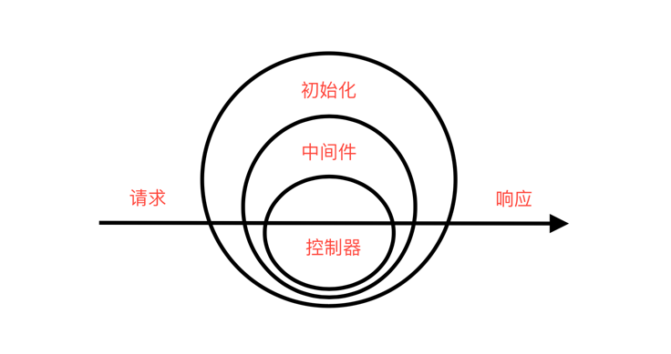

## P.I.G Web Service

---
P.I.G 是一个基础网页服务程序框架, 提供了基础的洋葱模型, 最简化的核心模块, 用户可以按需通过编写插件或者引入第三方插件的方式, 来扩展 P.I.G 的功能模块.

#### 运行图示

---


#### 功能示例

---
##### Hello world
```go
package main

import (
"github.com/gorilla-go/pig"
)

func main() {
	r := pig.NewRouter()
	r.GET("/", func(context *pig.Context) {
		context.Response().Echo("hello world")
	})

	pig.New().Router(r).Run(8088)
}
```

##### 路由

---
> P.I.G 提供了基础的路由功能, 用户可以通过编写路由规则, 来实现不同的功能.
> 也可以自行实现路由接口, 接入自定义路由或者第三方路由.

---
###### 基础路由
```go
package main
import (
	"github.com/gorilla-go/pig"
)

func main() {
	r := pig.NewRouter()
	r.GET("/user", func(context *pig.Context) {
		context.Response().Echo("hello world")
	})

	pig.New().Router(r).Run(8088)
}
```

###### 泛参数路由
```go
package main
import (
    "github.com/gorilla-go/pig"
)
func main() {
	r := pig.NewRouter()
	r.GET("/user/:id", func(context *pig.Context) {
		context.Response().Echo(
			context.Request().ParamVar().TrimString("id"),
        )
	})

	pig.New().Router(r).Run(8088)
}
```

###### 正则参数路由
```go
package main
import (
    "github.com/gorilla-go/pig"
)
func main() {
	r := pig.NewRouter()
	r.GET("/user/<id:\\d+>", func(context *pig.Context) {
		context.Response().Echo(
			context.Request().ParamVar().TrimString("id"),
        )
	})

	pig.New().Router(r).Run(8088)
}
```

###### 缺省路由
```go
package main

import (
	"github.com/gorilla-go/pig"
)

func main() {
	r := pig.NewRouter()
	r.Miss(func(context *pig.Context) {
		context.Response().Echo("404")
	})

	pig.New().Router(r).Run(8088)
}
```

##### 中间件

---
> P.I.G 实现了基础的中间件功能, 用户可以通过编写中间件, 来实现不同的功能.
---

###### 前置中间件
```go
package main

import (
	"fmt"
	"github.com/gorilla-go/pig"
)

type Middleware struct {
}

func (m *Middleware) Handle(context *pig.Context, next func(*pig.Context)) {
	fmt.Println("Middleware")
	next(context)
}

func main() {
	r := pig.NewRouter()
	r.GET("/", func(context *pig.Context) {
		context.Response().Echo("Hello, World")
	})

	pig.New().Use(&Middleware{}).Router(r).Run(8088)
}
```

###### 后置中间件
```go
package main

import (
	"fmt"
	"github.com/gorilla-go/pig"
)

type Middleware struct {
}

func (m *Middleware) Handle(context *pig.Context, next func(*pig.Context)) {
	next(context)
	fmt.Println("Middleware")
}

func main() {
	r := pig.NewRouter()
	r.GET("/", func(context *pig.Context) {
		context.Response().Echo("Hello, World")
	})

	pig.New().Use(&Middleware{}).Router(r).Run(8088)
}
```

###### 路由中间件
```go
package main

import (
	"fmt"
	"github.com/gorilla-go/pig"
)

type Middleware struct {
}

func (m *Middleware) Handle(context *pig.Context, next func(*pig.Context)) {
	fmt.Println("Route Middleware")
	next(context)
}

func main() {
	r := pig.NewRouter()
	r.GET("/", func(context *pig.Context) {
		context.Response().Echo("Hello, World")
	}, &Middleware{})

	pig.New().Router(r).Run(8088)
}
```
> 请注意, 路由中间件只会在指定的路由中生效. 并且定义了路由中间件, 全局中间件将不再生效.
> 如果需要需要全局中间件, 请在路由中间件中包含全局中间件.

##### 请求

---
###### 请求参数
```go
package main

import (
	"github.com/gorilla-go/pig"
)

func main() {
	r := pig.NewRouter()
	
	// Get 请求参数
	r.GET("/:id", func(context *pig.Context) {
		context.Response().Json(map[string]interface{}{
			"id": context.Request().ParamVar().Int("id"),
		})
	})

	// Post 请求参数
	r.POST("/post/:id", func(context *pig.Context) {
		context.Response().Json(map[string]interface{}{
			"id":   context.Request().ParamVar().Int("id"),
			"post": context.Request().PostVar().String("post"),
		})
	})

	pig.New().Router(r).Run(8088)
}
```

###### 文件上传
```go
package main

import (
	"github.com/gorilla-go/pig"
)

func main() {
	r := pig.NewRouter()

	// 上传
	r.POST("/upload", func(context *pig.Context) {
		filePath := context.Request().FileVar()["file"].FilePath
		context.Response().Echo(filePath)
	})

	// 归档存储
	r.POST("/upload/archive", func(context *pig.Context) {
		file := context.Request().FileVar()["file"]
		file = file.ArchiveMove("/your/dest/dir")
		context.Response().Echo(file.FilePath)
	})

	// 移动文件
	r.POST("/upload/rename", func(context *pig.Context) {
		file := context.Request().FileVar()["file"]
		file = file.Move("/your/dest/file.jpg")
		context.Response().Echo(file.FilePath)
	})

	pig.New().Router(r).Run(8088)
}

```

###### 原始请求
```go
package main

import (
	"github.com/gorilla-go/pig"
	"net/http"
)

func main() {
	r := pig.NewRouter()
	r.GET("/:id", func(context *pig.Context) {
		req := context.Request()
		context.Response().Json(map[string]interface{}{
			"method": req.Raw().Method,
			"uri":    req.Raw().RequestURI,
		})
	})

	pig.New().Router(r).Run(8088)
}
```
##### 响应

---
###### 文本
```go
package main

import (
	"github.com/gorilla-go/pig"
)

func main() {
	r := pig.NewRouter()
	r.GET("/", func(context *pig.Context) {
		context.Response().Echo("hello world")
	})

	pig.New().Router(r).Run(8088)
}
```

###### JSON
```go
package main

import (
	"github.com/gorilla-go/pig"
)

func main() {
	r := pig.NewRouter()
	r.GET("/", func(context *pig.Context) {
		context.Response().Json(map[string]interface{}{
			"id":   context.Request().ParamVar().Int("id"),
		})
	})

	pig.New().Router(r).Run(8088)
}
```

###### 文件下载
```go
package main

import (
	"github.com/gorilla-go/pig"
)

func main() {
	r := pig.NewRouter()
	r.GET("/download", func(context *pig.Context) {
		context.Response().Download(
			pig.NewFile("/your/file/path.jpg"),
			"filename.jpg",
		)
	})

	pig.New().Router(r).Run(8088)
}
```

###### 重定向
```go
package main

import (
	"github.com/gorilla-go/pig"
)

func main() {
	r := pig.NewRouter()
	r.GET("/redirect", func(context *pig.Context) {
		context.Response().Redirect("/redirected", 302)
	})

	pig.New().Router(r).Run(8088)
}
```
###### 原生响应
```go
package main

import (
	"github.com/gorilla-go/pig"
)

func main() {
	r := pig.NewRouter()
	r.GET("/", func(context *pig.Context) {
		context.Response().Raw().Write([]byte("hello world"))
	})

	pig.New().Router(r).Run(8088)
}
```

##### 依赖注入

---
###### 懒加载
> 懒加载会在使用的时候动态加载类, 内部自动实现了锁机制, 保证了线程安全.
```go
package main

import (
	"fmt"
	"github.com/gorilla-go/pig/di"
)

type User struct {
	Name string
}

func main() {
	container := di.New()
	di.ProvideLazy(container, func(c *di.Container) (*User, error) {
		return &User{
			Name: "pig",
		}, nil
	})

	di.MustInvoke[*User](container)
}

```

###### 单例
> 始终返回同一个实例.
```go
package main

import (
	"github.com/gorilla-go/pig/di"
)

type User struct {
	Name string
}

func main() {
	container := di.New()
	di.ProvideValue(container, &User{Name: "pig"})
	di.MustInvoke[*User](container)
}

```

###### 及时加载
> 在每次调用的时候, 构建一个全新的实例.
```go
package main

import (
	"fmt"
	"github.com/gorilla-go/pig/di"
)

type User struct {
	Name string
}

func main() {
	container := di.New()
	di.ProvideNew(container, func(c *di.Container) (*User, error) {
		return &User{
			Name: "pig",
		}, nil
	})

	di.MustInvoke[*User](container)
}

```
> 所有的加载方式均支持传入接口, 返回实例.

##### 最佳实践

---
###### 默认参数
```go
package main

import (
	"fmt"
	"github.com/gorilla-go/pig/foundation"
)

func main() {
	DefaultParams("no default")
	DefaultParams("default", 200)
}

func DefaultParams(p string, i ...int) {
	defCode := foundation.DefaultParam(i, 0)
	fmt.Println(defCode)
}
```

###### 日志
```go
package main

import (
	"github.com/gorilla-go/pig"
	"github.com/gorilla-go/pig/di"
	"log"
)

type Logger struct{}

func (*Logger) Info(message string) {
	log.Println(message)
}

func (*Logger) Debug(message string) {
	log.Println(message)
}

func (*Logger) Warning(message string) {
	log.Println(message)
}

func (*Logger) Fatal(message string) {
	log.Println(message)
}

type Middleware struct {
}

func (*Middleware) Handle(c *pig.Context, next func(*pig.Context)) {
	di.ProvideValue[pig.ILogger](c.Container(), &Logger{})
	next(c)
}

func main() {
	r := pig.NewRouter()
	r.GET("/", func(c *pig.Context) {
		c.Logger().Info("Hello World!", c)
	})

	pig.New().Use(&Middleware{}).Router(r).Run(8088)
}
```
> 用户自行实现日志处理或加载第三方日志框架.

###### 错误处理
```go
package main

import (
	"fmt"
	"github.com/gorilla-go/pig"
	"github.com/gorilla-go/pig/di"
)

type HttpErrorHandler struct {
}

func (h *HttpErrorHandler) Handle(a any, context *pig.Context) {
	fmt.Println("error targeted")
	context.Response().Echo("500", 500)
}

type Middleware struct {
}

func (*Middleware) Handle(c *pig.Context, next func(*pig.Context)) {
	di.ProvideValue[pig.IHttpErrorHandler](c.Container(), &HttpErrorHandler{})
	next(c)
}

func main() {
	r := pig.NewRouter()
	r.GET("/", func(c *pig.Context) {
		panic("error")
	})

	pig.New().Use(&Middleware{}).Router(r).Run(8088)
}

```


